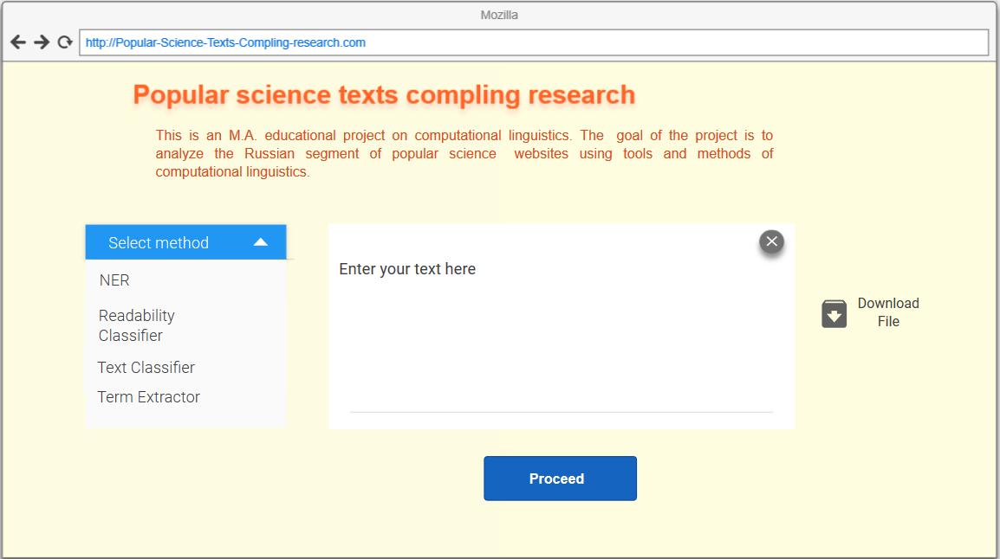

## Meet up 03.10.2018
## Большие задачи 

* Разработка API 
* Веб-интерфейс 

__Команда:__

- Анастасия Кузнецова
- Лапидус Анна 
- Коломенская Юлия 
- Самойленко Ксения 
- Семенова Наталья 

### Архитектура API 

_Ответственный:_ Семенова Наталья

- Посоветоваться с С. Собко по архитектуре API. 

__Pipeline:__

1. Приложение получает запросы от пользователя в виде научно-популярного текста; 
2. Отправляет на сервер ;
3. Получает ответ.

## Интерфейс

- Ссылки на код
- Ссылки на описания 
- Оценка работы API
- Остальное -- если останется время. 

## Прочие задачи 

- Выложить все бинарники/код итп в открытый доступ ;
- Каждый из членов команды перерабатывает код из исследовательского в рабочий.  

## Модули приложения

### NER модуль 

_Ответственный:_ Кузнецова Анастасия 

Список подмодулей, входящих в NER модуль:

1. `launch_tomita.py` Модуль отвечающий за вызов томита-парсера из приватного модуля. 
    - Принимает на вход текст от пользователя (`user_text`), записывает его в служебный файл томиты. 
    - Через `bash` запускает томита-парсер на составленных ранее грамматике, газетире.
2. `bootstrap_ner.py` Модуль, отвечающий за постпроцессинг `xml` вывода томиты. 
    - Парсит исходный  `xml` вывод томиты.
    - Очищает получившийся список имен от георафических терминов и слов, не являющихся именами (словарных слов). 
    - Проходится по списку имен, извлеченных из большого корпуса научпоп текстов и выделяет их в пользовательском тексте. 
3. `parse_ner.py` Основной модуль. Отвечает за вызов функций из предыдущих модулей, выдает вывод программы пользователю. Вызывается из API. 

_Текущий статус модулей:_ 

1. `launch_tomita.py`: Завершен. Необходимо создание `jinja` шаблонов для конфигурации служебный файлов томита-парсера (`user_enrty.txt`) и организации многопоточности. 
2. `bootstrap_ner.py`: Завешен. 
3.  `parse_ner.py`: Завершен. 

_Завершение работы над `python` модулями:_  28.10.2018

_Ссылка на код:_ 

[NER-модуль](https://github.com/ana-kuznetsova/Popular-Science-Texts-Compling-research/tree/master/api_modules/ner_module)

### Text Classifier 

_Ответственный:_ Лапидус Анна 

Список подмодулей, входящих в `text_classifier`:

1. Основной модуль, вызывается через API при получении текста пользователя, вызывает функции из других модулей.
2. Модуль предобработки текста и расчета признаков для классификатора. Принимает на вход текст пользователя, возвращает датасет признаков.
3. Классификатор. Принимает на вход датасет признаков, возвращает результат классификации.

_Текущий статус модулей:_

1. Основной модуль - в работе.
2. Модуль предобработки - в работе.
3. Классификатор - в работе.

_Завершение работы над `python` модулями:_ 01.11.2018

_Ссылка на код:_ 

### Term Extractor 

_Ответственный:_ Коломенская Юлия 

Список подмодулей, входящих в `term_extractor`:

1. модуль по извлечению терминов из текста `term_extractor.py`
2. фильтры для модуля (n-граммы, стоп-слова, части слов, частотный словарь РЯ)

_Текущий статус модулей:_

1. `term_extrator.py` - завершен
2. фильтры - обновлены и дополнены

_Завершение работы над `python` модулями:_
04.11.2018

_Ссылка на код:_ 
https://github.com/ana-kuznetsova/Popular-Science-Texts-Compling-research/blob/master/api_modules/term_extraction/term_extractor.py

### Readability Classifier 

_Ответственный:_ Самойленко Ксения 

Список подмодулей, входящих в `redability_classifier`:

1. `stat_metrics.py` — базовый модуль, к которому обращаются все остальные. Считает статистические характеристики текста: длину, количество слов, среднюю длину предложений, количество слогов в словах, и т.д.
2. `readability_metrics.py` — модуль адаптированных для русского языка метрик ридабилити - каждая из функций возрвращает уровень сложности текста согласно метрике
3. `readability_dictionary_compare` — лемматизирует и сравнивает слова со словарными списками и возвращает долю разговорных, общеупотребительных слов и научных терминов в тексте.
4. `pos_tags` — размечает текст по частям речи и считает долю каждой части речи в тексте.

_Текущий статус модулей:_

1. `stat_metrics.py` — завершен 
2. `readability_metrics.py` — завершен
3. `readability_dictionary_compare` — в целом завершен; словарь терминов нуждается в обновлении
4. `pos_tags` — завершен

_Завершение работы над `python` модулями:_
31.10.18

_Ссылка на код:_ 
[Readability-модуль](https://github.com/ana-kuznetsova/Popular-Science-Texts-Compling-research/tree/master/api_modules/rb_module)

### Сборка приложения, API

_Ответственный:_ Семенова Наталья

Список подмодулей, входящих в API/приложение:

1. Бекенд: написать обертку с помощью фреймворка Flask, загрузить модули, описанные выше (4 шт.); понять, нужно ли кеширование (тогда сделать), сделать очереди (Celery).
2. Фронтенд: сделать шаблон (пока остановились на шаблонизаторе `jinja2`) и расширения для него.
3. Тест: оттестить стабильность попеременной работы модулей, устранить возникающие баги.
4. Написать апи для корректной отдачи по http-запросам (REST API), оттестить (Postman).

_Текущий статус модулей:_

1. Бекенд: создание базовой структуры веб-приложения на Flask.
2. Фронтенд: разработка базового шаблона для рендеринга + разработка веб-интерфейса.  
3. Апи: разобраться в коде С.Собко (пример шаблона для апи).

Примерный вариант веб-интерфейса:   
_Ссылка на код:_ 

## Отслеживание статуса проекта 

Отслеживание прогресса задач проекта по [ссылке](https://github.com/ana-kuznetsova/Popular-Science-Texts-Compling-research/projects/2?add_cards_query=is%3Aopen).
